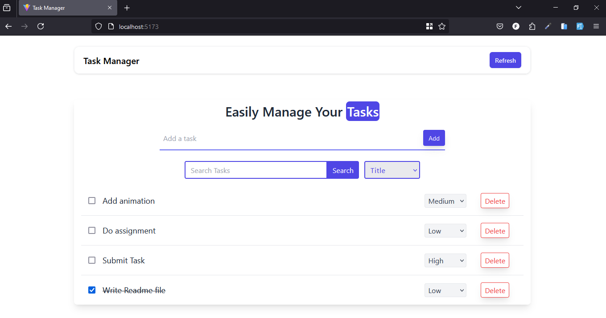

<h1 align="center">Task Manager</h1>

<p align="center">
  
</p>


## Project Overview
This Task Manager App is a React-based tool designed to help users manage tasks effectively.
It includes essential features like task addition, deletion, and persistence in localStorage,
with extra functionalities to enhance organization and productivity.

## Features:
* **Task Input:** Add tasks by title.
* **Task Deletion:** Remove tasks easily.
* **Task Persistence:** Saves tasks in localStorage to retain data after refresh.
* **Task Search:** Filter tasks by title.
* **Task Completion:** Mark tasks as done with a checkbox.
* **Priority Setting:** Assign priorities (Low, Medium, High) to tasks.
* **Task Sorting:** Sort tasks by title, priority, or completion status.
* **UI Animation:** Smooth task animations enhance the user experience.

## Functionality
* **Adding/Deleting Tasks:** Users can add tasks, which are saved in localStorage, and delete tasks easily.
* **Searching/Sorting:** Find and organize tasks by title, priority, or completion.
* **Task Persistence:** All task data is saved in localStorage, preserving it across sessions.

This app is an efficient, user-friendly task management tool with smooth animations for an engaging experience.


Installed Npm Packages:
```
framer-motion
react
react-dom
sort-by
localforage
daisyui
react-hot-toast
tailwindcss
vite
```

### How to Set Up Locally

1. Clone the Repo 
    ```sh
   git clone https://github.com/younusFoysal/Task-Manager.git
   ```
2. Install npm packages:
    ```sh
    npm i
    ```
2. Run the development server:
    ```sh
    npm run dev
    ```
3. Browse the application at:
    ```sh
    http://localhost:5173/
    ```